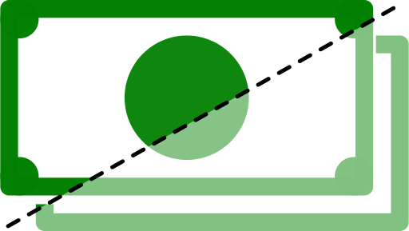

# CostDivider

## Description
It is a project heavily inspired by [ihatemoney](https://github.com/spiral-project/ihatemoney).   
The goal of this project is to create an simple overview of spendings and distribute them between the participants, to make the shared budgeting easier.

## Installation

## Credits
[KGeri201](https://github.com/KGeri201)  
[CodeBatYT](https://github.com/CodeBatYT)

## License
[Apache License 2.0](LICENSE)

## Project status
In development.
